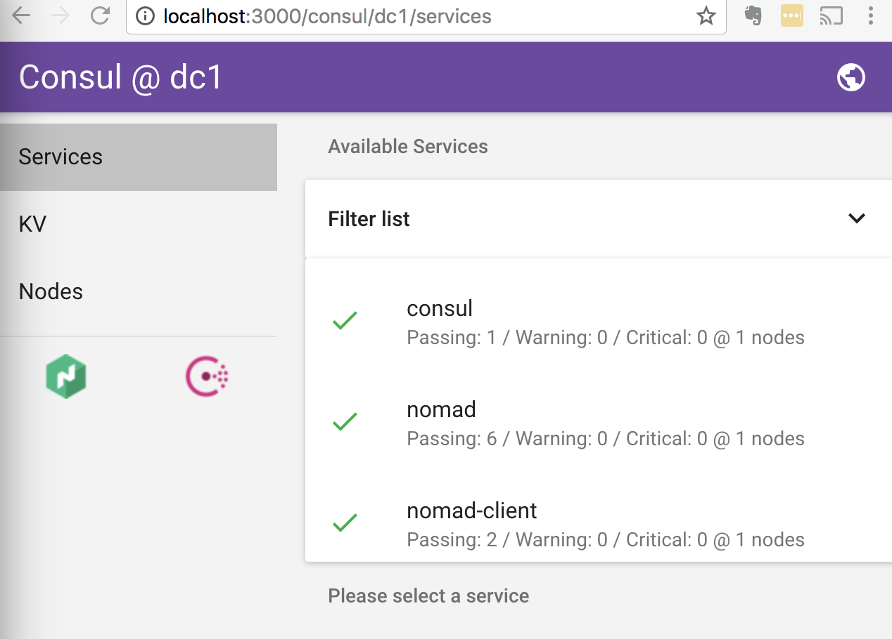
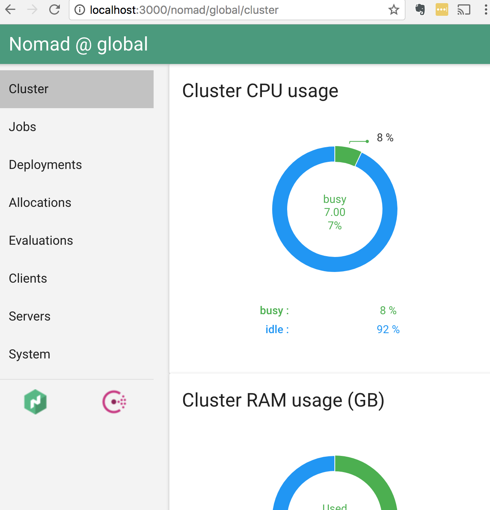
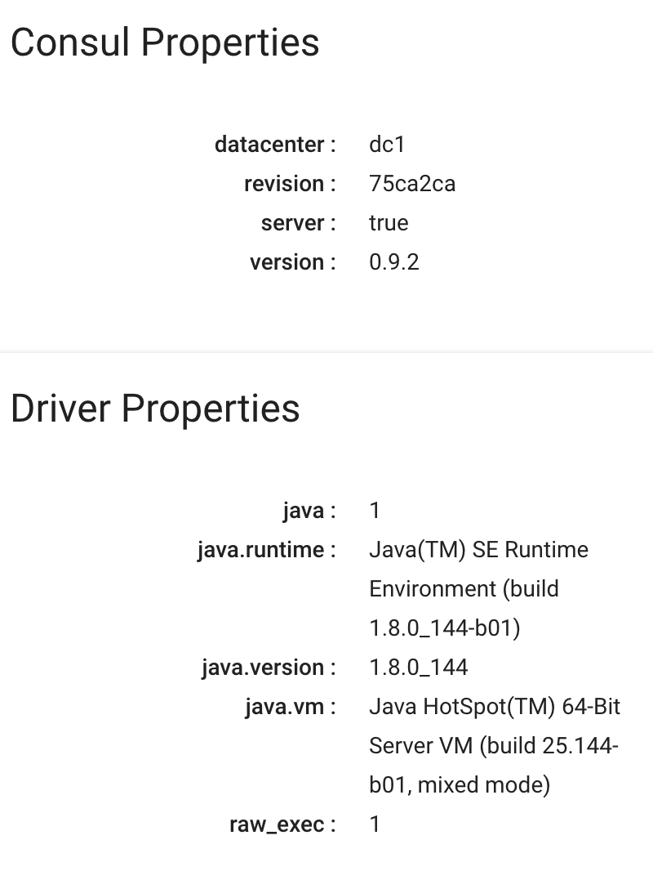

#  Setup Native Scheduling ElasticSearch Cluster Locally + AzureRM Using Nomad (Part 1)

## TL;DR
In order to run distributed Java workload natively; there is no need to run it in Docker, incurring an additional layer of abstraction; while still retaining proper workload isolation.  Demo how a Nomad Job Specification is created by porting from existing ElasticSearch startup script.  Examples will be running native ElasticSearch single node and also cluster. 

### Getting Started

For Part 1; we will run Consul + Nomad in local development mode.  This will be used to deploy the workloads. If you are new to Nomad, read more about it [here](https://www.nomadproject.io/intro/index.html).  It also assumes your machine already has the latest Java JDK installed.

Get the necessary binaries here:
- [Consul](https://www.consul.io/downloads.html) - Latest version is v0.9.2
- [Nomad](https://www.nomadproject.io/downloads.html) - Latest version is v0.6.2
- [ElasticSearch](https://www.elastic.co/downloads/elasticsearch) - Latest version is v5.5.2
- [Hashi UI](https://github.com/jippi/hashi-ui/releases) - Latest version is v0.17.0.  This is optional but is excellent to debug and track the service being deployed.

Startup Consul in development mode:
```bash
leow$ ./bin/consul agent -data-dir=/tmp/consul  -dev                        
==> Starting Consul agent...                                                        
==> Consul agent running!                 
           Version: 'v0.9.2'              
           Node ID: '4ef7d00e-a000-69c2-15e8-9db378ea0d14'                          
         Node name: 'Michaels-MacBook-Pro.local'
        Datacenter: 'dc1'
            Server: true (bootstrap: false)
       Client Addr: 127.0.0.1 (HTTP: 8500, HTTPS: -1, DNS: 8600)
      Cluster Addr: 127.0.0.1 (LAN: 8301, WAN: 8302)
    Gossip encrypt: false, RPC-TLS: false, TLS-Incoming: false

==> Log data will now stream in as it occurs:

    2017/09/01 17:00:37 [DEBUG] Using random ID "4ef7d00e-a000-69c2-15e8-9db378ea0d1
    ...
```

Confirm startup:
```bash
leow$ ./bin/consul members
Node                        Address         Status  Type    Build  Protocol  DC
Michaels-MacBook-Pro.local  127.0.0.1:8301  alive   server  0.9.2  2         dc1

```

Startup Nomad in development mode:
```bash
leow$ ./bin/nomad agent -data-dir=/tmp/nomad -dev    
    No configuration files loaded                                                   
==> Starting Nomad agent...                                                
==> Nomad agent configuration:                                                      
                                                                                    
                Client: true                                                        
             Log Level: DEBUG                                                       
                Region: global (DC: dc1)                                            
                Server: true                                                        
               Version: 0.6.2                                                       
                     
==> Nomad agent started! Log data will stream in below:                             
                                                                                    
    2017/09/01 17:09:49 [INFO] raft: Initial configuration (index=1): [{Suffrage:Vo$
er ID:127.0.0.1:4647 Address:127.0.0.1:4647}]                                       
    2017/09/01 17:09:49 [INFO] raft: Node at 127.0.0.1:4647 [Follower] entering Fol$
ower state (Leader: "")                                                             
    ...
```

Confirm startup:
```bash
# Server Node status
leow$ ./bin/nomad server-members
Name                               Address    Port  Status  Leader  Protocol  Build  Datacenter  Region
Michaels-MacBook-Pro.local.global  127.0.0.1  4648  alive   true    2         0.6.2  dc1         global

# Agent Node status
leow$ ./bin/nomad node-status
ID        DC   Name                        Class   Drain  Status
5b8fef23  dc1  Michaels-MacBook-Pro.local  <none>  false  ready
```

Start up Hashi UI (Optional); nicer GUI to monitor both Consul + Nomad:
```bash
leow$ ./bin/hashi-ui-darwin-amd64 --consul-enable --nomad-enable                                                                         
(28159) 2017/09/01 17:27:43.775995 {"level":"info","msg":"application created","cont
ext":{"app":"hashi-ui","enabled":false,"version":"1.9.0"}}                          
17:27:43.776 main.go:60 ▶ INFO  ----------------------------------------------------
-------------------------                                                           
17:27:43.776 main.go:61 ▶ INFO  |                             HASHI UI              
                        |                                                           
17:27:43.776 main.go:62 ▶ INFO  ----------------------------------------------------
-------------------------                                                           
17:27:43.776 main.go:64 ▶ INFO  | listen-address        : http://0.0.0.0:3000       
..
```

Confirm startup:

- Go to the URL `http://localhost:3000` to see 
- Consul UI:
   
- Nomad UI:
   


Confirm Nomad Client (Laptop) has recognized the Java driver:

- Click the "Clients" link in the sidebar and click on the ID link for the laptop:
    
     
    
### Single Node

In order to get started porting over the ElasticSearch startup scripts, get the latest ES binaries.  It can be served locally to mimic its binary deployment in production as an artifact.  Use any local web server like http-server to serve the directory in which the binary has been downloaded to.  Get http-server via the command `npm install -g http-server` if not already available.

```bash
# The downloaded ES zip file is stored in the ELASTICSEARCH folder
leow$ http-server ELASTICSEARCH/
Starting up http-server, serving ELASTICSEARCH/
Available on:
  http://127.0.0.1:8080
  http://192.168.1.13:8080
```

It can also be downloaded direct from ElasticSearch but to be faster we store and serve it locally.

The artifact stanza can be used to indicate where to download the ElasticSearch binary and can be check-summed for extra security:
```hcl
      artifact {
        source = "http://localhost:8080/elasticsearch-5.5.2.zip"
        // source = "https://artifacts.elastic.co/downloads/elasticsearch/elasticsearch-5.5.2.zip"
        destination = "local"
        options {
          checksum = "sha1:9d549e8f3d2bc5051fdf6973e2edd110f04c6dc3"
        }
      }
```

For ES to be run using the Java driver; the startup script needs to be ported to fit the java driver stanza.  In the startup script for ElasticSearch (inside ./bin/elasticsearch folder), the relevant command looks like below:

```bash
    exec "$JAVA" $ES_JAVA_OPTS -Des.path.home="$ES_HOME" -cp "$ES_CLASSPATH" \
          org.elasticsearch.bootstrap.Elasticsearch "$@"
```

The necessary attributes for java driver is as below for a simple setup (only one node running).

The $ES_CLASSPATH matches `class_path` attribute under the `config` section.  The `class` needed to run is `org.elasticsearch.bootstrap.Elasticsearch`:
```hcl
job "search" {
  datacenters = [
    "dc1"
  ]
  type = "service"
...  
  group "simple" {
    count = 1
...
    task "elasticsearch" {
      driver = "java"
...
      config {
        class = "org.elasticsearch.bootstrap.Elasticsearch"
        class_path = "local/elasticsearch-5.5.0/lib/*"
...
```

The environment variable that needs to be passed in.  `ES_HOME` will need to point as in the artifact stanza; which in this case inside the `local` directory.
```hcl
      env {
        ES_CLUSTER_NAME = "docker-cluster"
        ES_HOME = "local/elasticsearch-5.5.0"
      }
```


The Java config options is in the jvm.options file ($ES_JAVA_OPTS):
```bash
leow$ head -20 config/jvm.options 
## JVM configuration
...
# Xms represents the initial size of total heap space
# Xmx represents the maximum size of total heap space
-Xms2g
-Xmx2g
...
## GC configuration
-XX:+UseConcMarkSweepGC
-XX:CMSInitiatingOccupancyFraction=75
-XX:+UseCMSInitiatingOccupancyOnly

## optimizations

# pre-touch memory pages used by the JVM during initialization
-XX:+AlwaysPreTouch
...
# flags to configure Netty
-Dio.netty.noUnsafe=true
-Dio.netty.noKeySetOptimization=true
-Dio.netty.recycler.maxCapacityPerThread=0

# log4j 2
-Dlog4j.shutdownHookEnabled=false
-Dlog4j2.disable.jmx=true
-Dlog4j.skipJansi=true
...
## GC logging

#-XX:+PrintGCDetails
#-XX:+PrintGCTimeStamps
#-XX:+PrintGCDateStamps
#-XX:+PrintClassHistogram
...
```

will look like below:
```hcl
      config {
        class = "org.elasticsearch.bootstrap.Elasticsearch"
        class_path = "local/elasticsearch-5.5.0/lib/*"
        jvm_options = [
          "-Des.path.home=${ES_HOME}",
          "-Xmx512m",
          "-Xms512m",
          "-XX:+UseConcMarkSweepGC",
          "-XX:CMSInitiatingOccupancyFraction=75",
          "-XX:+UseCMSInitiatingOccupancyOnly",
          "-XX:+DisableExplicitGC",
          "-XX:+AlwaysPreTouch",
          "-server",
          "-Xss1m",
          "-Djava.awt.headless=true",
          "-Dfile.encoding=UTF-8",
          "-Djna.nosys=true",
          "-Djdk.io.permissionsUseCanonicalPath=true",
          "-Dio.netty.noUnsafe=true",
          "-Dio.netty.noKeySetOptimization=true",
          "-Dio.netty.recycler.maxCapacityPerThread=0",
          "-Dlog4j.shutdownHookEnabled=false",
          "-Dlog4j2.disable.jmx=true",
          "-Dlog4j.skipJansi=true",
          "-XX:+HeapDumpOnOutOfMemoryError"
        ]
      }
```
Template is like:
```hcl
      template {
        data = <<EOH
          cluster.name: {{ env "ES_CLUSTER_NAME" }}
          network.host: {{ env "attr.unique.network.ip-address" }}
          network.publish_host: {{ env "attr.unique.network.ip-address" }}
          http.port: {{ env "NOMAD_HOST_PORT_eshttp" }}
          transport.tcp.port: {{ env "NOMAD_HOST_PORT_estransport" }}
          bootstrap.memory_lock: true
          # Below are tweaks which may only be suitable in dev environments
          cluster.routing.allocation.disk.threshold_enabled: false
      EOH
        destination = "local/elasticsearch-5.5.0/config/elasticsearch.yml"
      }
```
Nomad will extract the needed from the agent client; IP Address will be located 

; which should be removed 

#### Gotcha
This is 

If did not have the matching the -ms512 and -mx512 to match; you will get OOM error if the overall memory usage exceeds the limit in the `resources` stanza.  The rule of thumb, have memory allocated to be 2x the Heap size

Where the full Single Node ElasticSearch Job Specificationn looks like below:

```
<script src="https://gist.github.com/leowmjw/5ffd63b70fb56565f5269b398ac3cacf.js"></script>
```

### Cluster Node

The relevant portion of the ElasticSearch config is as per below.  There is a hack in there if IPv6 localhost is detected, the Address used should be localhost as there seems to be some problem with the local Consul run in dev mode .. :(

```bash
...
          cluster.name: {{ env "ES_CLUSTER_NAME" }}
          network.host: {{ env "attr.unique.network.ip-address" }}
          discovery.zen.minimum_master_nodes: 2
          # network.publish_host: {{ env "attr.unique.network.ip-address" }}
          {{ if service "escluster-transport"}}discovery.zen.ping.unicast.hosts:{{ range service "escluster-transport" }}
            - {{ if eq .Address "::1" }}localhost{{ else }}{{ .Address }}{{ end }}:{{ .Port }}{{ end }}{{ end }}
          http.port: {{ env "NOMAD_HOST_PORT_eshttp" }}
          transport.tcp.port: {{ env "NOMAD_HOST_PORT_estransport" }}
...
```

The important part is the need the dynamic host ports to be filled in that is indicated earlier under the service stanza pointing to the ES Transport port.

```bash
      service {
        name = "escluster-transport"
        port = "estransport"
      }
```

### ESCluster UI Cerebro
The deplioyment of cluster ElasticSearch can be viewed using the nicely done UI called erebro

Showing the flexibility

### What About Docker?
It is not a mutually exclusive decision, the beauty of Nomad is that it can run different type of workloads together; which also includes Docker.  So, for example, we can run the ESCluster UI Cerebro as   

In fact,we can also run Hashi-UI as a docker job ..

```bash
nomad plan ./jobs/es-cerebro.nomad

nomad run ./jobs/es-cerebro.nomad

nomad status
```

### Output
You can confirm the ES by doing the foloowing curl 
This is how to index data ..
Also, the output for 

### What Next?

In the next article, we'll use the latest [Nomad Box](https://github.com/leowmjw/nomad-box) to deploy the setup into a full multi-machine Nomad Cluster; and explore more intricacies of the different ElasticSearch node types (master node, observer node, data nodes); and how it should be deployed with example Nomad Job Examples.
