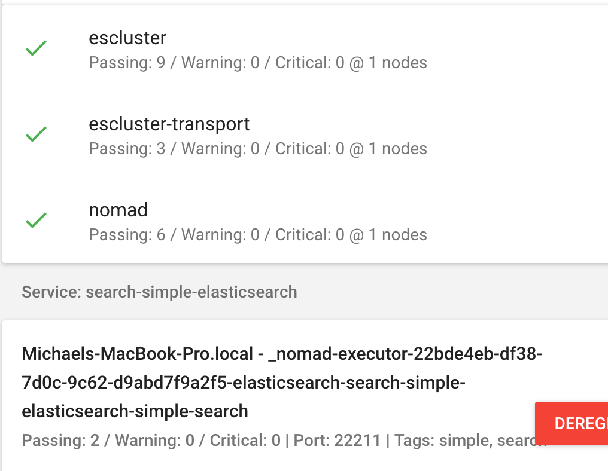

#  Setup Native Scheduling ElasticSearch Cluster Locally + AzureRM Using Nomad (Part 1)

## TL;DR
In order to run distributed Java workload natively; there is no need to run it in Docker, incurring an additional layer of abstraction; while still retaining proper workload isolation.  Demo how a Nomad Job Specification is created by porting from existing ElasticSearch startup script.  Examples will be running native ElasticSearch single node and also cluster. 

### Getting Started

For Part 1; we will run Consul + Nomad in local development mode.  This will be used to deploy the workloads. If you are new to Nomad, read more about it [here](https://www.nomadproject.io/intro/index.html).  It also assumes your machine already has the latest Java JDK installed.

Get the necessary binaries here:
- [Consul](https://www.consul.io/downloads.html) - Latest version is v0.9.2
- [Nomad](https://www.nomadproject.io/downloads.html) - Latest version is v0.6.2
- [ElasticSearch](https://www.elastic.co/downloads/elasticsearch) - Latest version is v5.5.2
- [Hashi UI](https://github.com/jippi/hashi-ui/releases) - Latest version is v0.17.0.  This is optional but is excellent to debug and track the service being deployed.

Startup Consul in development mode:
```bash
leow$ ./bin/consul agent -data-dir=/tmp/consul  -dev                        
==> Starting Consul agent...                                                        
==> Consul agent running!                 
           Version: 'v0.9.2'              
           Node ID: '4ef7d00e-a000-69c2-15e8-9db378ea0d14'                          
         Node name: 'Michaels-MacBook-Pro.local'
        Datacenter: 'dc1'
            Server: true (bootstrap: false)
       Client Addr: 127.0.0.1 (HTTP: 8500, HTTPS: -1, DNS: 8600)
      Cluster Addr: 127.0.0.1 (LAN: 8301, WAN: 8302)
    Gossip encrypt: false, RPC-TLS: false, TLS-Incoming: false

==> Log data will now stream in as it occurs:

    2017/09/01 17:00:37 [DEBUG] Using random ID "4ef7d00e-a000-69c2-15e8-9db378ea0d1
    ...
```

Confirm startup:
```bash
leow$ ./bin/consul members
Node                        Address         Status  Type    Build  Protocol  DC
Michaels-MacBook-Pro.local  127.0.0.1:8301  alive   server  0.9.2  2         dc1

```

Startup Nomad in development mode:
```bash
leow$ ./bin/nomad agent -data-dir=/tmp/nomad -dev    
    No configuration files loaded                                                   
==> Starting Nomad agent...                                                
==> Nomad agent configuration:                                                      
                                                                                    
                Client: true                                                        
             Log Level: DEBUG                                                       
                Region: global (DC: dc1)                                            
                Server: true                                                        
               Version: 0.6.2                                                       
                     
==> Nomad agent started! Log data will stream in below:                             
                                                                                    
    2017/09/01 17:09:49 [INFO] raft: Initial configuration (index=1): [{Suffrage:Vo$
er ID:127.0.0.1:4647 Address:127.0.0.1:4647}]                                       
    2017/09/01 17:09:49 [INFO] raft: Node at 127.0.0.1:4647 [Follower] entering Fol$
ower state (Leader: "")                                                             
    ...
```

Confirm startup:
```bash
# Server Node status
leow$ ./bin/nomad server-members
Name                               Address    Port  Status  Leader  Protocol  Build  Datacenter  Region
Michaels-MacBook-Pro.local.global  127.0.0.1  4648  alive   true    2         0.6.2  dc1         global

# Agent Node status
leow$ ./bin/nomad node-status
ID        DC   Name                        Class   Drain  Status
5b8fef23  dc1  Michaels-MacBook-Pro.local  <none>  false  ready
```

Start up Hashi UI (Optional); nicer GUI to monitor both Consul + Nomad:
```bash
leow$ ./bin/hashi-ui-darwin-amd64 --consul-enable --nomad-enable                                                                         
(28159) 2017/09/01 17:27:43.775995 {"level":"info","msg":"application created","cont
ext":{"app":"hashi-ui","enabled":false,"version":"1.9.0"}}                          
17:27:43.776 main.go:60 ▶ INFO  ----------------------------------------------------
-------------------------                                                           
17:27:43.776 main.go:61 ▶ INFO  |                             HASHI UI              
                        |                                                           
17:27:43.776 main.go:62 ▶ INFO  ----------------------------------------------------
-------------------------                                                           
17:27:43.776 main.go:64 ▶ INFO  | listen-address        : http://0.0.0.0:3000       
..
```

Confirm startup:

- Go to the URL `http://localhost:3000` to see 
- Consul UI:
   
- Nomad UI:
   


Confirm Nomad Client (Laptop) has recognized the Java driver:

- Click the "Clients" link in the sidebar and click on the ID link for the laptop.  You should see the driver properties of java set to 1:
    
     
    
### Single Node

In order to get started porting over the ElasticSearch startup scripts, get the latest ES binaries.  It should be served locally to mimic its binary deployment in production as an artifact.  Use any local web server like http-server to serve the directory in which the binary has been downloaded to.  Get http-server via the command `npm install -g http-server` if not already available.

Serve the downloaded file (in zip format, no need to unzip!) as per below:
```bash
# The downloaded ES zip file is stored in the ELASTICSEARCH folder
leow$ http-server ELASTICSEARCH/
Starting up http-server, serving ELASTICSEARCH/
Available on:
  http://127.0.0.1:8080
  http://192.168.1.13:8080
```

Nomad can actually download the needed artifact directly from ElasticSearch site (which is what will be done in production); but to be faster in iterating during development we store and serve it locally.

The artifact stanza can be used to indicate where to download the ElasticSearch binary and can be check-summed (SHA1) for extra security:
```hcl
      artifact {
        source = "http://localhost:8080/elasticsearch-5.5.2.zip"
        // source = "https://artifacts.elastic.co/downloads/elasticsearch/elasticsearch-5.5.2.zip"
        destination = "local"
        options {
          checksum = "sha1:9d549e8f3d2bc5051fdf6973e2edd110f04c6dc3"
        }
      }
```

For ElasticSearch (ES) to be run using the Java driver; the startup script needs to be ported to fit the java driver stanza.  In the startup script for ElasticSearch (found it `./bin/elasticsearch`), the relevant command to start ES looks like below:

```bash
    exec "$JAVA" $ES_JAVA_OPTS -Des.path.home="$ES_HOME" -cp "$ES_CLASSPATH" \
          org.elasticsearch.bootstrap.Elasticsearch "$@"
```

The necessary attributes for java driver is as below for a simple setup (only one node running):

The $ES_JAVA_OPTS matches `jvm_options` attribute under the `config` stanza:

```bash
leow$ head -20 ./config/jvm.options 
## JVM configuration
...
# Xms represents the initial size of total heap space
# Xmx represents the maximum size of total heap space
-Xms2g
-Xmx2g
...
## GC configuration
-XX:+UseConcMarkSweepGC
-XX:CMSInitiatingOccupancyFraction=75
-XX:+UseCMSInitiatingOccupancyOnly
# pre-touch memory pages used by the JVM during initialization
-XX:+AlwaysPreTouch
...
# flags to configure Netty
-Dio.netty.noUnsafe=true
-Dio.netty.noKeySetOptimization=true
-Dio.netty.recycler.maxCapacityPerThread=0

# log4j 2
-Dlog4j.shutdownHookEnabled=false
-Dlog4j2.disable.jmx=true
-Dlog4j.skipJansi=true
...
## GC logging
#-XX:+PrintGCDetails
#-XX:+PrintGCTimeStamps
#-XX:+PrintGCDateStamps
#-XX:+PrintClassHistogram
...
```

will look like below after ported:
```hcl
      config {
        class = "org.elasticsearch.bootstrap.Elasticsearch"
        class_path = "local/elasticsearch-5.5.2/lib/*"
        jvm_options = [
          "-Des.path.home=${ES_HOME}",
          "-Xmx512m",
          "-Xms512m",
          "-XX:+UseConcMarkSweepGC",
          "-XX:CMSInitiatingOccupancyFraction=75",
          "-XX:+UseCMSInitiatingOccupancyOnly",
          "-XX:+DisableExplicitGC",
          "-XX:+AlwaysPreTouch",
          "-server",
          "-Xss1m",
          "-Djava.awt.headless=true",
          "-Dfile.encoding=UTF-8",
          "-Djna.nosys=true",
          "-Djdk.io.permissionsUseCanonicalPath=true",
          "-Dio.netty.noUnsafe=true",
          "-Dio.netty.noKeySetOptimization=true",
          "-Dio.netty.recycler.maxCapacityPerThread=0",
          "-Dlog4j.shutdownHookEnabled=false",
          "-Dlog4j2.disable.jmx=true",
          "-Dlog4j.skipJansi=true",
          "-XX:+HeapDumpOnOutOfMemoryError"
        ]
      }
```

The environment variable that needs to be passed in are done using the `env` stanza.  The $ES_HOME was used above to specify the `es.path.home` indicates where the binary downloaded under the `artifact` stanza artifact is unzipped to; which is inside the `local` directory.
```hcl
      env {
        ES_HOME = "local/elasticsearch-5.5.2"
      }
```

The $ES_CLASSPATH matches `class_path` attribute under the `config` stanza.  The `class` needed to run is `org.elasticsearch.bootstrap.Elasticsearch`.  Since this is a single ES node, count will be 1:
```hcl
job "search" {
  datacenters = [
    "dc1"
  ]
  type = "service"
...  
  group "simple" {
    count = 1
...
    task "elasticsearch" {
      driver = "java"
...
      config {
        class = "org.elasticsearch.bootstrap.Elasticsearch"
        class_path = "local/elasticsearch-5.5.2/lib/*"
...
```
To specify the resources needed by each ES node, use the `resource` stanza.  The important section is the port mapping labels which maps to the ES port of 9200 and 9300; respectively `eshttp` and `estransport`.  This will be mapped as an environment variable `NOMAD_HOST_PORT_eshttp` and `NOMAD_HOST_PORT_estransport` inside the ES instance.

```hcl
      resources {
        # 150 MHz; burstable
        cpu = 150
        # 2GB; twice memory alloc
        disk = 2048
        # 1024 MB
        memory = 1024
        network {
          mbits = 100
          port "eshttp" {}
          port "estransport" {}
        }
      }
```

The last piece to port over is the `elasticsearch.yml` file.  This is implemented in Nomad via the consul-template integration using the `template` stanza.  The minimum template for a single node is very simple; specifying host IP address and ports; as per below:
```hcl
      template {
        data = <<EOH
          network.host: {{ env "attr.unique.network.ip-address" }}
          network.publish_host: {{ env "attr.unique.network.ip-address" }}
          http.port: {{ env "NOMAD_HOST_PORT_eshttp" }}
          transport.tcp.port: {{ env "NOMAD_HOST_PORT_estransport" }}
          bootstrap.memory_lock: true
          # Below are tweaks which may only be suitable in dev environments
          cluster.routing.allocation.disk.threshold_enabled: false
      EOH
        destination = "local/elasticsearch-5.5.2/config/elasticsearch.yml"
      }
```

Since the original `elasticsearch.yml` file is inside the config directory, thus the `destination` of the dynamically generated template must also be the config directory relative to the location defined in `es.path.home` under the `jvm_options` attribute of the `config` stanza.

Nomad will extract the needed unique attributes at runtime from the Nomad agent client.  Example of these attributes are like IP Address.

Any further configuration (like where data and logs is stored) can be added the the above sample template.

The full Single Node ElasticSearch Job Specification is:

<script src="https://gist.github.com/leowmjw/5ffd63b70fb56565f5269b398ac3cacf.js"></script>

#### Plan and Run Job for Single Node
Now that the full Job Specification for a Single ES Node is done, it can be scheduled and deployed.

- Plan:
```bash
leow$ ./bin/nomad plan nomad-samples/java/go-elasticsearch/elasticsearch.nomad 
+ Job: "search"
+ Task Group: "simple" (1 create)
    + Task: "elasticsearch" (forces create)

Scheduler dry-run:
- All tasks successfully allocated.
```

- Run:
```bash
leow$ ./bin/nomad run nomad-samples/java/go-elasticsearch/elasticsearch.nomad 
==> Monitoring evaluation "b8e814d9"
    Evaluation triggered by job "search"
    Evaluation within deployment: "2e8c1de6"
    Allocation "63eb5336" created: node "307205b9", group "simple"
    Evaluation status changed: "pending" -> "complete"
==> Evaluation "b8e814d9" finished with status "complete"
```
Complete command that should be seen is:
```bash
leow$ java -Des.path.home=local/elasticsearch-5.5.2 -Xmx512m -Xms512m -XX:+UseConcMarkSweepGC -XX:CMSInitiatingOccupancyFraction=75 -XX:+UseCMSInitiatingOccupancyOnly -XX:+DisableExplicitGC -XX:+AlwaysPreTouch -server -Xss1m -Djava.awt.headless=true -Dfile.encoding=UTF-8 -Djna.nosys=true -Djdk.io.permissionsUseCanonicalPath=true -Dio.netty.noUnsafe=true -Dio.netty.noKeySetOptimization=true -Dio.netty.recycler.maxCapacityPerThread=0 -Dlog4j.shutdownHookEnabled=false -Dlog4j2.disable.jmx=true -Dlog4j.skipJansi=true -XX:+HeapDumpOnOutOfMemoryError -cp "local/elasticsearch-5.5.2/lib/*" org.elasticsearch.bootstrap.Elasticsearch
```

#### Verifying Single Node
Nomad Allocation once correct will show green in both Consul and Nomad as per below:
- Consul:

- Nomad:


Issue the following curl call to confirm ES is working by checking the end-point and cluster health status:

- ES Endpoint:
```bash
leow$ curl -L "http://127.0.0.1:22499"
{
  "name" : "HhucESm",
  "cluster_name" : "elasticsearch",
  "cluster_uuid" : "nkPe_zVhSRuLgMHU9M3WUw",
  "version" : {
    "number" : "5.5.2",
    "build_hash" : "b2f0c09",
    "build_date" : "2017-08-14T12:33:14.154Z",
    "build_snapshot" : false,
    "lucene_version" : "6.6.0"
  },
  "tagline" : "You Know, for Search"
}
```

- Cluster Health:
```bash
leow$ curl -L "http://127.0.0.1:22499/_cluster/health"
{"cluster_name":"elasticsearch","status":"green","timed_out":false,"number_of_nodes":1,"number_of_data_nodes":1,"active_primary_shards":0,"active_shards":0,"relocating_shards":0,"initializing_shards":0,"unassigned_shards":0,"delayed_unassigned_shards":0,"number_of_pending_tasks":0,"number_of_in_flight_fetch":0,"task_max_waiting_in_queue_millis":0,"active_shards_percent_as_number":100.0}
```

#### Gotcha
If the specified heap size for the ES workload is too low; you will get OOM error if the overall memory usage exceeds the limit in the `resources` stanza.  The rule of thumb is to have memory allocated to be 2x the Heap size.


### Multi-Node Cluster 

The relevant portion of the ElasticSearch config is as per below. It indicates that there needs to have at least 2 master nodes out of 3 nodes to declare quorum of the cluster.  The node discovery mechanism is set to be the unicast zen with the existing master node types available.

```bash
...
          cluster.name: {{ env "ES_CLUSTER_NAME" }}
          network.host: [ "0.0.0.0" ]
          discovery.zen.minimum_master_nodes: 2
          # network.publish_host: {{ env "attr.unique.network.ip-address" }}
          {{ if service "escluster-transport"}}discovery.zen.ping.unicast.hosts:{{ range service "escluster-transport" }}
            - {{ if eq .Address "::1" }}localhost{{ else }}{{ .Address }}{{ end }}:{{ .Port }}{{ end }}{{ end }}
          http.port: {{ env "NOMAD_HOST_PORT_eshttp" }}
          transport.tcp.port: {{ env "NOMAD_HOST_PORT_estransport" }}
...
```
There is a workaround above where if IPv6 localhost is detected for `.Address`, it should be rewritten to localhost as Consul in dev mode does not seem to like IPv6 bind address :(

Another important part is the need for the dynamic host ports to be filled in to the `discovery.zen.ping.unicast.hosts` section of the config.  This is done by iterating through the host inside the service named `escluster-transport` in the `service`.  No health check is specified so that it is registered immediately and visible to consul-template processing the above `template` stanza.

```bash
      service {
        name = "escluster-transport"
        port = "estransport"
      }
```

#### Plan and Run Job for Multi-Node ES Cluster
Now that the full Job Specification for a Multi-Node ES Cluster is done, it can be scheduled and deployed.

- Plan:
```bash
leow$ ./bin/nomad plan nomad-samples/java/go-elasticsearch/cluster-elasticsearch.nomad 
+/- Job: "search"
+   Task Group: "complex" (3 create)
    + Task: "elasticsearch" (forces create)

+/- Task Group: "simple" (1 create/destroy update)
  +/- EphemeralDisk {
    +/- Migrate: "true" => "false"
    +/- SizeMB:  "5000" => "300"
    +/- Sticky:  "true" => "false"
      }
  +/- Task: "elasticsearch" (forces create/destroy update)
    +/- Env[ES_HOME]: "local/elasticsearch-5.5.2" => "/local/elasticsearch-5.5.2"
...
       + Envvars:      "false"
        + LeftDelim:    "{{"
        + Perms:        "0644"
        + RightDelim:   "}}"
          SourcePath:   ""
        + Splay:        "5000000000"
        + VaultGrace:   "300000000000"
        }
    -   Template {
        - ChangeMode:   "restart"
          ChangeSignal: ""
        - DestPath:     "local/elasticsearch-5.5.2/config/elasticsearch.yml"
Michaels-MacBook-Pro:tmp leow$ 
```

- Run:
```bash
leow$ ./bin/nomad run nomad-samples/java/go-elasticsearch/cluster-elasticsearch.nomad 
==> Monitoring evaluation "806b59a3"
    Evaluation triggered by job "search"
    Allocation "1b071736" created: node "307205b9", group "simple"
    Allocation "68953103" created: node "307205b9", group "complex"
    Allocation "74b1365d" created: node "307205b9", group "complex"
    Allocation "920f3a93" created: node "307205b9", group "complex"
    Evaluation within deployment: "11bda5c7"
    Evaluation status changed: "pending" -> "complete"
==> Evaluation "806b59a3" finished with status "complete"
```

#### Verifying Multi-Node ES Cluster
Nomad Allocation once correct (notice the previous Single Node ES is also running simultaneously) will show green in both Consul and Nomad as per below:

- Consul:
 
- Nomad:
 

#### Gotcha
For the `template` stanza, the `change_mode` attribute needs to be set to "noop", otherwise it means

### What About Docker?
It is not a mutually exclusive decision, the beauty of Nomad is that it can run different type of workloads together; which also includes Docker.  So, for example, we can run the ESCluster UI Cerebro as   

### ESCluster UI Cerebro
The deplioyment of cluster ElasticSearch can be viewed using the nicely done UI called erebro

Showing the flexibility

In fact,we can also run Hashi-UI as a docker job ..

```hcl
  group "admin" {
    count = "1"
...
    task "cerebro" {
      driver = "docker"

      config {
        image = "yannart/cerebro:latest"
        port_map {
          cerebro = "9000"
        }
      }

      resources {   
...
        # 1024 MB
        memory = 1024
        network {
          port "cerebro" {
            static = "9000"
          }
        }
      }
...
    }
```
The full Multi-Node ElasticSearch Job Specification is:

<script src="https://gist.github.com/leowmjw/8174c224593d31cc06e90c4bc2e9977a.js"></script>

### Output
The Cerebro UI shows both the single node and multi-cluster ElasticSearch running simultaneously:

- Single node ElasticSearch:
 

- Multi-node ElasticSearch Cluster:
 

Happy Searching!

### What Next?

In the next article, we'll use the latest [Nomad Box](https://github.com/leowmjw/nomad-box) to deploy this setup into a full multi-machine Nomad Cluster; and explore more intricacies of the different ElasticSearch node types (master node, observer node, data nodes); and how it should be deployed for High Availabilty and High Performance.
