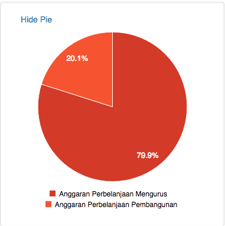

# Visualizing Joined Up Budget Data using OpenSpending Components

## Audience

- Program Officers looking to maximize budget implementing a "Joined Up" Data Application in a tight duration while still maintaining high quality.

- Application Developers looking for a working example of composing together independent, modular Components for their "Joined Up" Data Applications.

## Objective

- Demonstrate how a "Joined Up" Data Application can be assembled quickly and easily from independent Components.

- Walk through the assembly of a "Joined Up" Data Application data flow??

**NOTE:** For technical description of how the Components were developed; check out the companion article found [here](./Porting-OpenSpending-Components-VueJS.md)

## Scenario

In a constrained environment like in Malaysia as per my recent presentation about Open Government in Malaysia:

Information only becomes available in drip and drabs; and can only be collected in scraps bit by bit.  Data is available as silo-ed

Every October, the Malaysian Government presents its Budget for the upcoming year.  The data is published as non-machine readable PDF separated by specific Ministries.

In order to will present the budget; how can we make it accessible to the general public; and who to hold accountable?

A simple Proof-of-Concept (PoC) "Joined Up" Data Application should be assembled that allows the user to choose the Ministry to be scrutinized.

The data we want to be able to work with Popolo data; another project Sinar Project has been working on as the basic from the etc.  The budget data comes from the OpenSpending API.  

In summary:
PopIt - http://api.popit.sinarproject.org
OpenSpending - http://next.openspending.org

This is the good mantters; count on it .. this is the mannager ..

## Methodology

### High Level Architecture Sketch

In order to join up Ministry, Ministers and Budget data to fit the above scenario, a High Level Architecture might be made out of below Components:

a) A component that allows a Ministry to be selected; in which Published Budgets will displayed.  Each Published Budgets will be allowed to be  selected. [Ministry Selection and Published Budgets Component](#ministry-selection-and-published-budgets-component)

b) A component that reacts to the Ministry selection by the user and renders the details of the Minister and Deputies based on the data in PopIt [Minister Details Component](#minister-details-component)

c) A component that reacts to the selection event by the user of a Published Budget (via a unique identifier) and renders the default Visualization in the form of TreeMap, BubbleTree and Pie; but allows  further user interaction. [Budget Details Component](#budget-details-component)

d) Everything ties together via a messaging event bus [Application Component](#application-component)

### Drill-down to each Components

Let's have a look at the Components in further details based on the High Level Architecture Sketch above.  The exact make of the 

It is very readable etc.

The application can be broken down simply to 3 parts:

#### Application Component

a) Overall Application

    abc

PLaceholder here 

    

    

#### Ministry Selection and Published Budgets Component

b) Ministry Selection and their underlying Published Budgets
    
PLaceholder here 

    Show Ministry + Available Budgets

    

#### Minister Details Component

Once selected, below code becomes activated:

    

    c1) Ministers Details <related_ministries_info> component

    expands to ..

    Minister of the Chosen Ministry
     
    
    
This is how it is coded (in more details)
        
    

    c2) Budget Details <babbage_package> component

    abc
    
#### Budget Details Component

    

    

    

### Data Sources Details

- OpenSpending API: http://next.openspending.org
- PopIt Data of Ministers of Ministires for Fifth Cabinet of Najib Razak: http://api.popit.sinarproject.org
 

### Further Ideas

- We can also use Components like FixMyStreet () that will show the issues reported that can be tied back to .  For see example of http://www.aduanku.my. 

Other ideas might be to link any issue/questions brought up in the media for the Ministry so navigate the ownership of the problem solving

## Conclusion

In conclusion; the source code is very readablar and combine ..

Do not try to solve any problem direct from scratch.  A "Joined Up" Data Application can be swiftly assembled by composing a few components: "Ministry Selection and Published Budgets", "Ministry Details", "Budget Details" in various permutation to achieve the particular target.

everything with your App; reuse high quality
