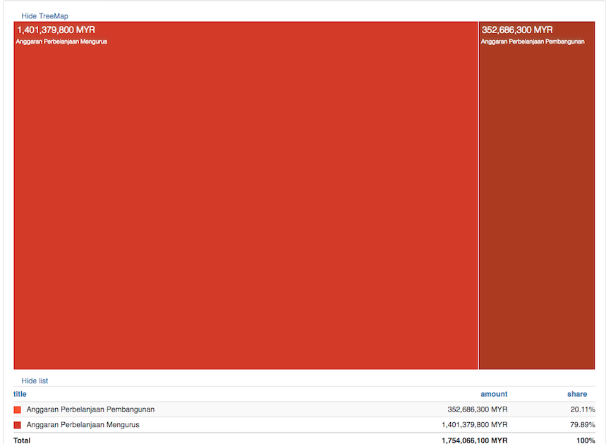

# Visualizing Joined Up Budget Data using OpenSpending Components

## Audience

- Program Officers looking to maximize budget implementing a "Joined Up" Data Application quickly and efficiently while still maintaining high quality.
- Application Developers looking for a working example of composing together independent, modular Components for their "Joined Up" Data Applications.

## Objective

- Demonstrate how a "Joined Up" Data Application can be assembled quickly and easily from independent Components.
- Walk through the assembly of a "Joined Up" Data Application with a real-life scenario, concrete examples and clear explanation of the details.

**NOTE:** For technical description of how the individual Components were developed; check out the companion article found [here](./Porting-OpenSpending-Components-VueJS.md)

## Scenario

In a constrained environment such as Malaysia information is only available in drip and drabs.  As per my recent presentation about [Open Government in Malaysia](https://docs.google.com/presentation/d/1IDijfN0AlVX4KE80LqRxGg7CrbR79u-X75TSGUHjTQw/edit?usp=sharing); data is not readily accessible in raw form, in proper machine-readable formats and data is mostly silo-ed; frustrating analysis.

In light of this, order to the budget; how can we make it accessible to the general public; and who to hold accountable?

Every October, the Malaysian Government presents its Budget for the upcoming year.  The data is published as non-machine readable PDF separated by specific Ministries.  Detailed information about Ministries and their associated Ministers are scattered around

The goal is to come up with a simple Proof-of-Concept (PoC) "Joined Up" Data Application (using the individual silo data below) that allows the user to choose the Ministry to be scrutinized against its published Budget in an easy, interactive and user-friendly manner (via Visualization).

The data we want to be able to work with have been cleaned up and made available in open accessible format (still silo-ed) at the following location:

Ministry + Ministers details (following [Popolo](http://www.popoloproject.com/specs/) standard):
PopIt - http://api.popit.sinarproject.org

The budget data comes from the OpenSpending API (following [Open Fiscal Data Package](http://specs.frictionlessdata.io/fiscal-data-package/) standard): 
OpenSpending - http://next.openspending.org

## Methodology

### High Level Architecture Sketch

In order to join up Ministry, Ministers and Budget data to fit the above scenario, a High Level Architecture might be made out of below Components:

a) A component that allows a Ministry to be selected; in which Published Budgets will displayed.  Each Published Budgets will be allowed to be selected independently to be visualized. [Ministry Selection and Published Budgets Component](#ministry-selection-and-published-budgets-component)

b) A component that reacts to the Ministry selection by the user and renders the details of the Minister and Deputies based on the data retrieved from the PopIt API. [Minister Details Component](#minister-details-component)

c) A component that reacts to the selection event by the user of a Published Budget (via a unique identifier) and renders the default Visualization in the form of TreeMap, BubbleTree and Pie; but allows  further user interaction. [Budget Details Component](#budget-details-component)

d) An overall component that wraps the 3 major Components described prior and handle the event communications based on the user action and events triggered. [Application Component](#application-component)

The final application with all the components assembled as per above looks as per below:
    
   

### Detailed Analysis of Components

Let's have a look at the individual Components; covered by the High Level Architecture Sketch above; in more details.  

We'll start with the overall Application Component which controls the functionality of this app:

#### Application Component

At the macro level, all 3 Sub-Components are clearly demarcated as per code below.  

However, only the first component is actually rendered until the user takes further action to select a Ministry. 
 
   

#### Ministry Selection and Published Budgets Component

The first component which allows the user to select the Ministry to be analyzed is made out of two section: Ministry Selection (marked as red) and (marked as orange); that will render the full list of available Published Budgets that the user can select for the next step in visualization.    

   

Once a Ministry has been selected by the user, the Components to show the Ministry Details along with the Budget Details now becomes activated:

   

#### Minister Details Component

The Minister Details Component will pull out the detailed data from the PopIt API of the user selected Ministry.  filtered under the "Fifth Cabinet of Najib Razak" to match up with the time period of the budget.

In the codebase seen earlier, this Component is referred to with the element named **<related_ministries_info>**: 
     
   
    
The Component code layout is fairly standard view of the Ministry details along with the high quality headshot image of the Ministry and any Deputies.
        
   
    
#### Budget Details Component

Next, let's look at the Budget Details Component; which will present an easy to navigate summary of the Published Budget data selected by the user.

Users that need more details can click on the link to **"OSNext"** where the full capabilities of the OpenSpending portal is available such as more Visualization options (e.g Pivot Table, San Key) and more powerful drill-down (different measures, different filters).

   

In the codebase seen earlier, this Component is referred to as the element that is named **<babbage_package>**.

The element **<babbage_package>** itself is made out of the 3 Sub-Components for visualizing the data in 3 forms: TreeMap, BubbleTree and Pie.

   

Each Sub-Component can be hidden from view by the user.  Multiple budgets can be visualized simultaneously as a unique packageid is used to differentiate and prevent overlaps.  

Each of the Sub-Component's items can be "drilled-down" by clicking on the section of interest; the next level of hierarchy of data will be shown.

**NOTE:** For technical description of how the Components were developed; check out the companion article found [here](./Porting-OpenSpending-Components-VueJS.md)

The TreeMap Sub-Component has the visual area size to represent the ratio of budgeted amount vis-a-vis the other line items in the same level of hierarchy.  This is expressed further down in clear TreeMap List which can be sorted by the raw amount as well as by its relative ration:

   

The BubbleTree Sub-Component also uses the relative size of the bubbles to indicate the ratio of values for any particular hierarchy level of the Measure:

   

The Pie Sub-Component is the most mundane of the three, a standard Pie Chart:
    
   

### Further Ideas

We can also use Components to wrap around other data sources like from Partners like [FixMyStreet](http://www.fixmystreet.org/) (FMS).  

In the context of Malaysia, we can provide a Component that allows the user to relate issues reported by our locally-branded FMS - [Aduanku](https://www.aduanku.my/) against the accountable parties at all levels of government; whether it is the Member of Parliament, State Assemblyman or the Local Councillor.  

Again, the "Joined Up" Data will involve composing against data extracted from the PopIt API. 

Finally; since Components are pretty much standalone, especially when implemented via VueJS; it makes it much easier to be incorporated into a normal static content site.  For example: A "Public Hospital Budget and Expenditure" Component used .  

This ability to easily embed interactive data / visualization  into a normal site in order to enhance comprehension and data exploration for non-developers as well as non-technical users, is particularly invaluable.

## Conclusion

A "Joined Up" Data Application assembled by composing Components is readable, understandable and can be easily reasoned about; even to a non-technical stakeholder like the Program Officer.

The message is clear: Do not try to solve any problem direct from scratch; reuse the available Components and share any new Components created.

The example "Joined Up" Data Application to hold Ministers under Ministry accountable via their Budget; demo-ed the process of swiftly assembling a complete functional app via composing the: **"Ministry Selection and Published Budgets", "Ministry Details", "Budget Details"** Components.

