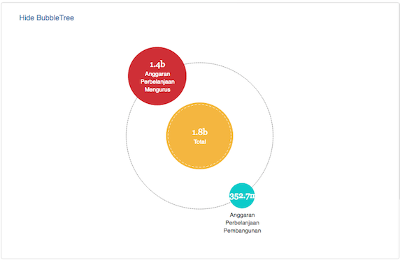

# Visualizing Joined Up Budget Data using OpenSpending Components

## Audience

- Program Officers looking to maximize budget implementing a "Joined Up" Data Application quickly and efficiently while still maintaining high quality.

- Application Developers looking for a working example of composing together independent, modular Components for their "Joined Up" Data Applications.

## Objective

- Demonstrate how a "Joined Up" Data Application can be assembled quickly and easily from independent Components.

- Walk through the assembly of a "Joined Up" Data Application with a real-life scenario, concrete examples and clear explanation of the details.

**NOTE:** For technical description of how the individual Components were developed; check out the companion article found [here](./Porting-OpenSpending-Components-VueJS.md)

## Scenario

In a constrained environment like in Malaysia as per my recent presentation about Open Government in Malaysia:

Information only becomes available in drip and drabs; and can only be collected in scraps bit by bit.  Data is available as silo-ed

Every October, the Malaysian Government presents its Budget for the upcoming year.  The data is published as non-machine readable PDF separated by specific Ministries.

In order to will present the budget; how can we make it accessible to the general public; and who to hold accountable?

A simple Proof-of-Concept (PoC) "Joined Up" Data Application should be assembled that allows the user to choose the Ministry to be scrutinized.

The data we want to be able to work with Popolo data; another project Sinar Project has been working on as the basic from the etc.  The budget data comes from the OpenSpending API.  

In summary:
PopIt - http://api.popit.sinarproject.org
OpenSpending - http://next.openspending.org

This is the good mantters; count on it .. this is the mannager ..

## Methodology

### High Level Architecture Sketch

In order to join up Ministry, Ministers and Budget data to fit the above scenario, a High Level Architecture might be made out of below Components:

a) A component that allows a Ministry to be selected; in which Published Budgets will displayed.  Each Published Budgets will be allowed to be selected independently to be visualized. [Ministry Selection and Published Budgets Component](#ministry-selection-and-published-budgets-component)

b) A component that reacts to the Ministry selection by the user and renders the details of the Minister and Deputies based on the data retrieved from the PopIt API. [Minister Details Component](#minister-details-component)

c) A component that reacts to the selection event by the user of a Published Budget (via a unique identifier) and renders the default Visualization in the form of TreeMap, BubbleTree and Pie; but allows  further user interaction. [Budget Details Component](#budget-details-component)

d) An overall component that wraps the 3 major Components described prior and handle the event communications based on the user action and events triggered. [Application Component](#application-component)

The final application with all the components assembled as per above looks as per below:
    
    

### Drill-down to each Components

Let's have a look at the individual Components; covered by the High Level Architecture Sketch above; in more details.  

We'll start with the overall Application Component which controls the functionality of this app:

#### Application Component

At the macro level, all 3 Sub-Components are clearly demarcated as per code below.  

However, only the first component is actually rendered until the user takes further action to select a Ministry. 
 
    

#### Ministry Selection and Published Budgets Component

The first component which allows the user to select the Ministry to be analyzed is made out of two section: Ministry Selection (marked as red) and (marked as orange); that will render the full list of available Published Budgets that the user can select for the next step in visualization.    

    

Once a Ministry has been selected by the user, the Components to show the Ministry Details along with the Budget Details now becomes activated:

    

#### Minister Details Component

This component is referred to with the element named **<related_ministries_info>**

    c1) Ministers Details <related_ministries_info> component

    expands to ..

    Minister of the Chosen Ministry
     
   
    
This is how it is coded (in more details)
        
   

    c2) Budget Details <babbage_package> component

    abc

Users that need more details can click on the link to **"OSNext"** where the full capabilities of the OpenSpending portal is available and these independent components become another lead-in for the platform.

   

    
#### Budget Details Component

This component is referred to with the element named **<babbage_package>**

The element "<babbage_package>" houses the following when drilled down:

    

The same budget data view is shown by default in 3 different visualization: TreeMap, BubbleTree and Pie Components.

**NOTE:** For technical description of how the Components were developed; check out the companion article found [here](./Porting-OpenSpending-Components-VueJS.md)

    

    

    

### Data Sources Details

- OpenSpending API: http://next.openspending.org
- PopIt Data of Ministers of Ministires for Fifth Cabinet of Najib Razak: http://api.popit.sinarproject.org
 

### Further Ideas

- We can also use Components like FixMyStreet () that will show the issues reported that can be tied back to .  For see example of http://www.aduanku.my. 

embed into a normal in order to enhance comprehension and data exploration

## Conclusion

A "Joined Up" Data Application assembled by composing Components is readable, understandable and can be easily reasoned about; even to a non-technical stakeholder like the Program Officer.

The message is clear: Do not try to solve any problem direct from scratch; reuse the available Components and share any new Components created.

The example "Joined Up" Data Application to hold Ministers under Ministry accountable via their Budget; demo-ed the process of swiftly assembling a complete functional app via composing the: **"Ministry Selection and Published Budgets", "Ministry Details", "Budget Details"** Components.

